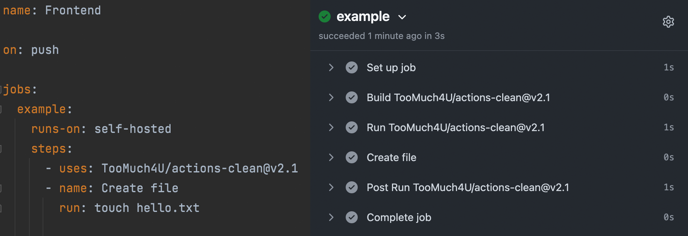

# Runner Post Cleanup
A Github Action to clean the runner workspace - mostly copied from https://github.com/colpal/actions-clean. 

This action will delete all files in the runners working directory at the end of the job. 
This is especially useful for self-hosted runners, where workspace files don't get deleted at the end of workflows.

## Example


## Usage
Add a step for the action (at any point in the job) and a post run job will delete any files left in the workspace.
```yaml
# ...
steps:
  - uses: TooMuch4U/runner-post-cleanup@v2.1
# - step 1
# - step 2
# - step 3
# - ...
```